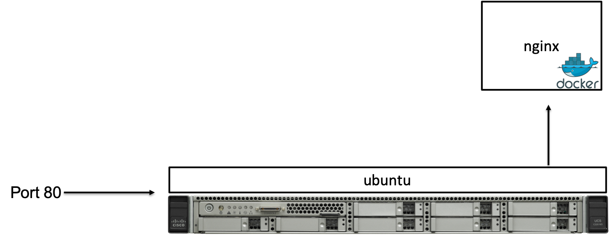
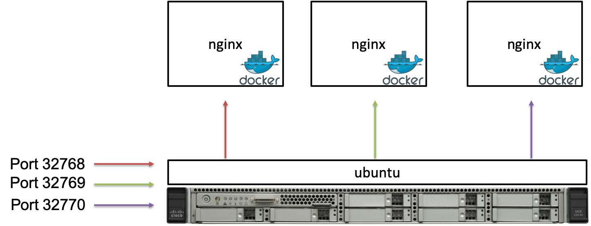
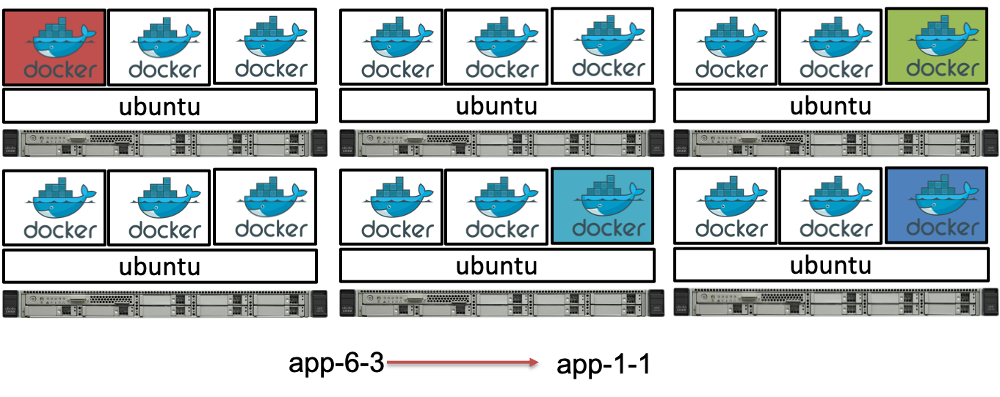

# Introduction

<blockquote class="twitter-tweet"><p lang="en" dir="ltr">The big antitrust story that no one talks about is that in 2014, Google quietly released a Stuxnet-like virus designed to cripple thousands and thousands of potential competitors from the inside out. It’s called Kubernetes.</p>&mdash; Zack Kanter (@zackkanter) <a href="https://twitter.com/zackkanter/status/1181757982494867457?ref_src=twsrc%5Etfw">October 9, 2019</a></blockquote> <script async src="https://platform.twitter.com/widgets.js" charset="utf-8"></script> 

Kubernetes has taken over the container management world. What used to be PaaS vendors have turned into opinionated Kubernetes vendors (Pivotal, OpenShift, VMware, etc. )

Other options championed by cloud vendors, even like the mighty AWS (fargate, ECS), have been steamrolled over by Kubernetes. 

Even the granddaddy, Docker, the company that started this revolution of using containers to deliver applications, has failed to be meaningful anymore in the world of managing the solution they came up with. 

Kubernetes today at the beginning of the roaring 20s is the technology to learn, and what better place to learn it than on the largest public cloud provider there is: AWS. 

This course takes us through provisioning a cluster on EKS, running applications on the cluster, setting up common infrastructure requirements, managing the lifecycle of the cluster, and finally integrating with other AWS services like DynamoDB databases. 


# Containers

Imagine the following play based on true life events before using containers: 

* `Developer:` Here is the is application that is ready to go into production.  I wrote it in python, just run it in production now!
* `Operations:` Ok, that sounds easy enough.  Let's see, just put it here in python and ... hey, its complaining about missing a library?  I can't tell what is wrong here...
* `Developer:` Ah, that's right!  You need the OpenCV library for this to work. 
* `Operations:` /grumble grumble... Ok, I got it installed, OpenCV but.. wait... It doesn't work.  Complains about something?  I can't tell, can you help me out? 
* `Developer:` Oh!  Forgot about that, the 3.0.1 version doesn't work. You have to use the 3.0.0 version as the bug doesn't exist there.  You know how open source software goes! Always an adventure!
* `Operations:` Ok, got the right version!  Should start now and... Gah!  It still doesn't run. What is wrong?  I've done everything I could!  Still doesn't work.  Have you tested this code? 
* `Developer:` So sorry, let me see.  It does run for me in my environment just fine... Ah, ok, I see, you are running with Python2.7.  This code is written for Python 3.8. 

And that is how the world worked getting things into production before.  Now realize that the app will change, faster than before and that these changes may bring new libraries and new environments.  Docker changes all that.  If we make the developer in charge of creating the docker container, or we as operations people give the developer the base containers we expect them to use then all the problems of [dependency hell](https://en.wikipedia.org/wiki/Dependency_hell) goes away. 

So containers are great and make our lives easier to reduce the friction required in getting development code into production.  Docker, then is lube for our data center. 

## Challenges with Docker

But like any solution, it brings with it tradeoffs and side effects.  With Docker, we now have some other issues.  To illustrate this, let's start with a simple example of running one container on a server: 

```
docker run -d -p 80:80 nginx
```


This server can be virtual or physical, or even your laptop.  If a person enters the IP address of the server into the browser they'll see the default nginx webpage that is created from the container. No problem here!  Docker works just fine. 

### A little more difficult

But let's make things a little more complicated: 

```
for i in $(seq 3); do docker run -d -P nginx; done
```


Here we have to use the `-P` flag because our server only has one port 80.  So docker assigns random ports (32768-3270) to the 3 containers we launched.  This still isn't bad. But now we have to remember which ports are being used.  We can set up another nginx server that is a reverse proxy to funnel traffic to these three containers and load balance between them.  That even allows us to do A/B testing fairly easy.  As long as our load isn't too bad, this is a cool solution!

But there are still problems with this:  

1. The ports will change as a container is stopped and restarted. 
2. The reverse proxy will have to be updated to reflect the change in the port. 
3. We should probably spread the load among more than one machine to make things more resiliant. 

Even with these few issues, this is a completely workable solution.  If we don't have a lot of load we can surely handle this pretty well.  But life, is usually a little more complicated than that. 
 
### Even more difficult

Let's suppose we have 6 machines and 18 different applications.  They all happen to be named `app${i}-${j}` where `i` is the server number and `j` is the application number.  We can launch these on our cluster of 6 servers with some simple bash foo: 

```
for i in $(seq 6); do for j in $(seq 3); do ssh node0$i docker run –d -P app${i}-${j}; done; done
```
We then get something like the following picture: 



Ok, this is rediculous.  Now we have a bunch of unknown ports as well as issues knowing which server our application is running on. 

To further complicate this, imagine app-6-3 is dependent upon app-1-1. (e.g: app-1-1 is a MariaDB database).  How will app-6-3 find it?  How will it adapt if app-1-1 needs to be restarted and the port changes? 

So we have a few problems: 

* How do we keep track of which port goes to which container on which host? 
* How can we efficiently allocate containers to hosts?  Not all apps use the resources as much.  We could have 30 containers on one host using less resources than 4 containers on another host.  We need a way to bin pack. 
* Microservices scale horizontally so how do we map service dependencies?  What if the MariaDB is a cluster of servers, how can we keep a consistent host name for the dependency when services go down? 
* Applications are frequently updated, ports are randomized, how do we account for all these frequent changes? 

And as such, several solutions have emerged. Docker Datacenter (no longer available), AWS ECS, Hashicorp Nomad,...

## The Kubernetes solution 

In 2015, Google [released a paper detailing how it does large scale cluster management with containers. ](https://research.google/pubs/pub43438/)
The paper outlined lessons learned and how those lessons learned were put into Kubernetes. (section 8 in the paper)

Kubernetes has built in mechanisms to solve all of the problems mentioned above. These solutions are as follows: 

* The kubelet communicates with the Kubernetes controller to track the ports used on each host of the container.  This information is stored in `etcd`.
* Containers are allocated using a Kubernetes scheduler which uses an agent on the nodes (the kubelet) to determine load. 
* Kubernetes has the idea of a [service](https://kubernetes.io/docs/concepts/services-networking/service/) that is a virtual IP of the underlying containers that make up the service.  As new pods (containers) change, the labels direct the virtual IP to the service. 
* Kubernetes has it's own service discovery with [kubeDNS](https://kubernetes.io/docs/concepts/services-networking/dns-pod-service/)

These and more issues are baked into Kubernetes.  When I first started using Mesos with Marathon we didn't have service discovery so we had to use Hashicorp Consul to do this.  That is 3 different open source projects!  Kubernetes bakes it all in together and even includes things like ingress controllers and custom resource definitions to extend the cluster.  We'll show all of these as we go along. 


# Kubernetes in a Nutshell

From the [kubernetes home page](https://kubernetes.io/):

"Kubernetes is an open-source system for automating deployment, scaling, and managmeent of containerized applications."

Kubernetes solves the problems [we spoke about in managing docker containers](containers.md). 

Ok, so what is it? Well, its clustering software. There are processes that run on controller machines and software that run on worker nodes.  However, you can also run kubernetes on just one node and run all the processes there.  But that's just for testing.  Really you'll have several worker nodes that run the software and at least one "controller" node. 

Take a look at the below picture which is found on the [Kubernetes website](https://kubernetes.io/docs/concepts/overview/components/): 


The Control Plane components are all those components that run on the master node(s), or controller machines.  That is the vertical rectangle.  

In EKS, this is the portion you don't have to worry about.  You do nothing other than pay the $0.10/hr for this to run.  

The horizontal rectangle is what is run on each of the nodes.  In the case of EKS, these processes are run on each of the EC2 instances. 

## Control Plane Processes

If you want to know more about the ends and outs of the control plane services, look at [this page](https://kubernetes.io/docs/concepts/overview/components/#control-plane-components) as this is the official Kubernetes docs.  A brief summary here: 

* `etcd`: Kubernetes is stateless. All state is stored in etcd. 
* `kube-apiserver`: process responsible for receiving input from `kubectl` and processes running in Kubernetes. 
* `kube-scheduler`: The bin packer.  Where to place containers that need to get scheduled? 
* `kube-controller-manager`: All controller processes run here.  If a pod goes down, it notices and restarts it. 
* `cloud-controller-manager`: for AWS the `kube-controller-manager` dishes commands from its controllers out to the cloud-controller-manager to create resources on its behalf to the cloud.  This includes interacting with AWS to create Load Balancers, Volumes, and networking routing for the pods. 

## Node Components

* `kubelet` The Kubelet agent runs on every node and is responsible for talking to docker and bringing up containers as directed by the scheduler.  
* `Kube-proxy` is used for creating IP tables rules so when nodes or other containers attempt to communicate with containers running on this node, IP Table rules forward traffic to the container.
* `Docker` while other container runtimes are possible, we mostly see docker running on these worker nodes.  

## Kubernetes Constructs
Now that we've seen what makes up the basic skeleton of the kubernetes cluster lets talk briefly about the key components that make Kubernetes special. 

### Pods
The pod is the atomic unit of management for kubernetes containers.  Sometimes we'll use the term "pod" interchangably with "container".  That is because most of the time in practice you'll only have one container in a pod.  However, a Pod denotes a runtime namespace for an application that sometimes similarly grouped containers will run in this one atomic unit.  Containers that run in a pod share the same IP address and access to storage volumes. 

The one reason this construct exists in the first time, rather than just managing a container is because the idea that the Borg paper laid out of having helper containers run that do health checks to the application running in the main container. 

By packaging in a container that can constantly give you the status of the application you can know when processes are down or not functioning correctly. 

The other reason this construct helps is the ability to do tricky networking proxying like that done by [Envoy](https://www.envoyproxy.io/)

### Deployments

A deployment is a declarative way of saying: "I want X amount of Pod Ys running".  If something happens to one of those pods, then the declaration lets the kube-controller know that things are not as they ought to be and it fixes it by creating a new one. Deployments declare you're intent. Often when creating a pod, we use a deployments to create them. 

All Kubernetes constructs can be given to the API server as YAML files. This is how we normally do things in Kubernetes.  

For example, here is a brief deployment example that you'll see we use in this class: 

```yaml
apiVersion: extensions/v1beta1
kind: Deployment
metadata:
  labels:
    run: ngx
  name: ngx
spec:
  replicas: 1
  selector:
    matchLabels:
      run: ngx
  template:
    metadata:
      labels:
        run: ngx
    spec:
      containers:
      - image: nginx
        name: ngx
```

Here we give it some metadata name, like the label of this deployment which is used by other Kubernetes constructs to refer to this deployment. We also define the spec of the container.  The docker image it gets is `nginx` and we call it all `ngx`. 

### Services

Services create a virtual static IP address (VIP) that allows us to refer to underlying pods that may always be changing.  For example, suppose we have 5 web servers running in our deployment. (change the `replicas` count to 5 in the above example.)  We would create a service, via a `yaml` file that would refer to these pods.  If a pod crashes or changes, or if more pods are added, the VIP stays the same, is loaded in KubeDNS and thus we can always refer to it as long as some pod exists on the backend that we can attach to. 

Here is a `yaml` example we will use later: 

```yaml
apiVersion: v1
kind: Service
metadata:
  labels:
    run: ngx
  name: ngx
spec:
  ports:
  - port: 80
    protocol: TCP
    targetPort: 80
  selector:
    run: ngx
```

Notice we refer to the port that the service is called from the outside as port `80`.  The `targetPort` is the port in the container we wish to hit.  This can be different and change.  For example, if you created a [Flask app](https://palletsprojects.com/p/flask/) and port `5000` was the default, you would set the `targetPort` to `5000` but call it externally by `port` `80`.

Services come in different types: 

* NodePort - IP is accessible by querying each individual node and then routed to an appropriate pod. 
* ClusterIP - IP is only accessible internal to the cluster. 
* LoadBalancer - IP is created by an external load balancer (NLB) and thus accessible outside the cluster.

We go into this later in more detail. 

### Ingress Controllers
The last point I'll briefly mention that makes kubernetes great is the ability to multiplex services.  Ingress Controllers are like services that you can fan out into different services by giving ingress rules.  We'll show this later.  When I first learned this, I didn't know I needed an ingress controller until I actually needed one.  Once you see why it makes a lot of sense.  We'll see this a little bit later in this course. 
