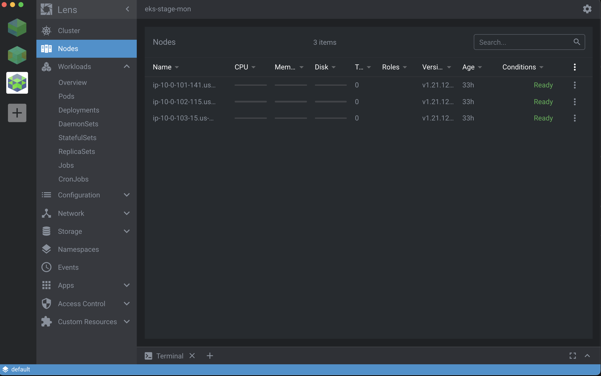
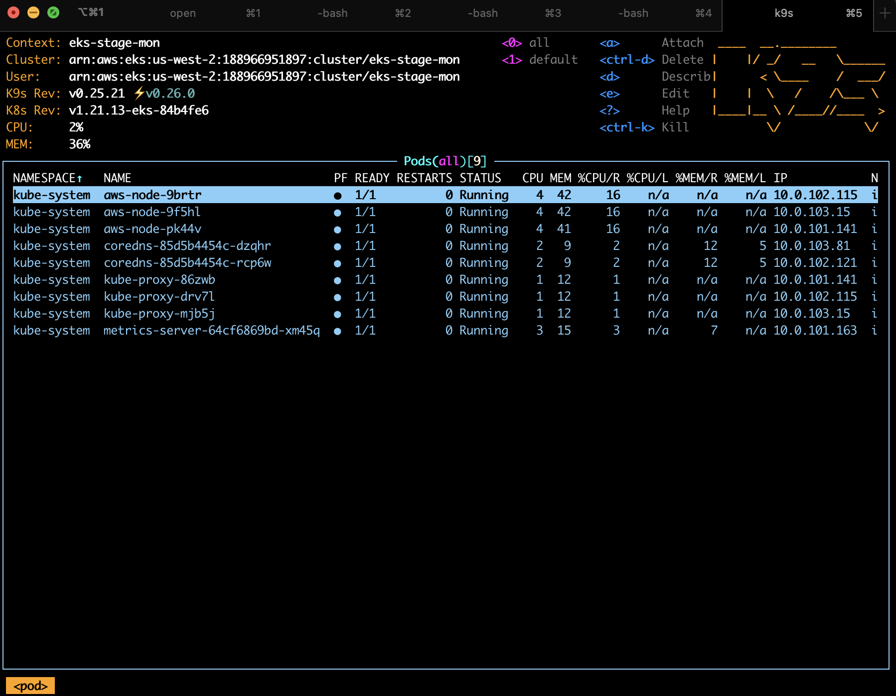

# Kubernetes Observability and Monitoring

If you've already completed part one of this class you'll have a cluster up that is ready to roll! If not, you'll need to get it all ready for the class. Let's get caught up


## 01. Set up Basic EKS

First set up the AWS IAM prerequisites we need.  We cover this a bit in the first class, so suffice to say, we just need to ensure we have proper groups, roles, users, and policies for our cluster.  This is magically done with the below commands.  Before you do that, ensure you have your own PGP key in the var file so you can actually decrpyt it.  See [../02/terraform.md](../02/terraform.md) for how to do this. 


```
cd terraform
terraform init
terraform plan 
terraform apply 
```

Now let's build everything. 

We have an EKS terragrunt plan in [terragrunt/live/stage-mon](../terragrunt/live/stage-mon).  To start run: 

```
terragrunt run-all apply 
```

This will set up the basic cluster you'll need as well as OpenSearch that we'll use for the logging portion of this class at the end. 

You may need to run this twice as there is a bug in the dependencies with Terragrunt. 

You should then add the cluster to your kube config with: 

```
aws eks update-kubeconfig --name eks-stage-mon \
	--alias eks-stage-mon \
	--role-arn arn:aws:iam::188966951897:role/eks_dude_role
```

## 02. Kubernetes Additional Components

Once you can access you're Kubernetes cluster you need to add the ingress controller, associate with Route 53, and then add the cert-manager components: 

See the [Route53 section](../04/r53.md) on how to do that. You'll also find cert-manager 

For this to work, you're going to need a domain!

Quick start: 

```
cd 04/nginx-ingress-controller
k apply -f deploy.yaml
cd ../cert-manager
k apply -f cert-manager.yaml 
k apply -f prod-issuer.yaml 
cd ../
k apply default-backend.yaml 
```

Now go to Route 53 and associate the domain with the ingress controller.  This a manual thing. 
## 03. Metrics API 

```
kubectl apply -f https://github.com/kubernetes-sigs/metrics-server/releases/latest/download/components.yaml
```

Once this is done we should be able to run: 

```
kubectl top nodes
kubectl top pods -A 
kubectl get —-raw /metrics
```

## 04. Basic Monitoring with Lens

[Lens](https://k8slens.dev/) used to be open source and awesome but like a lot of companies their shareholders wanted money so now you have to pay.  Fear not!  You can still get [OpenLens](https://github.com/crloz/openlens). There is still and install and open.  It should read your `~/.kube/config` and be able to open up a session. 



Have a look around and notice if there are any issues. 

## 05. K9s

Install [k9s](https://k9scli.io/topics/install/). k9s uses your current context to show your cluster and monitor different components. 



# Section 1 WrapUp

Cool, we now have a basic cluster, metrics are enabled and we have two different dashboard options we can look at to monitor our cluster.  Lens is great especially if you're not into remembering Kubernetes commands and just want a clean IDE to look at. 