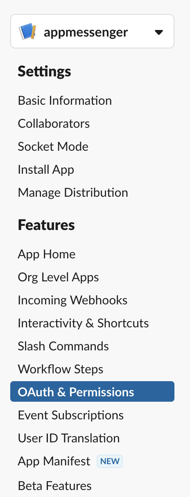
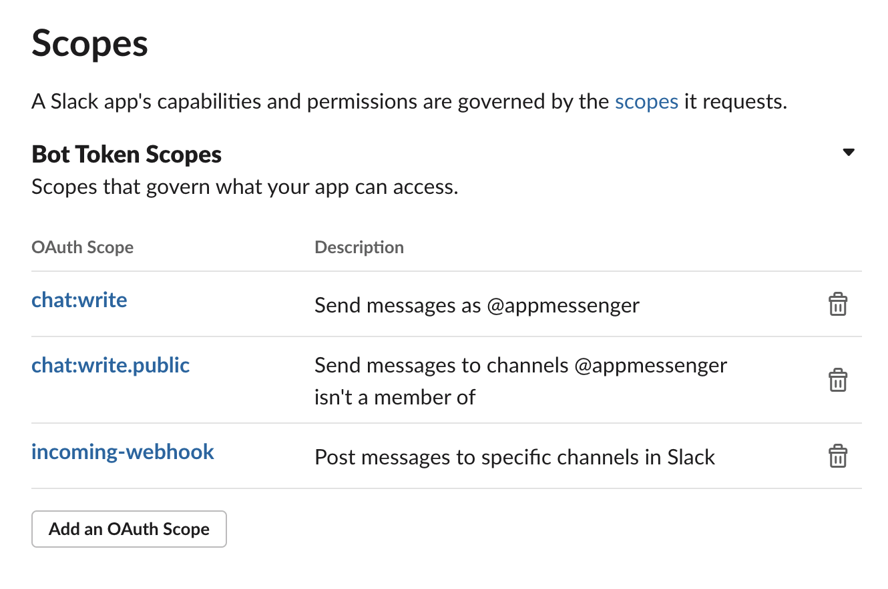
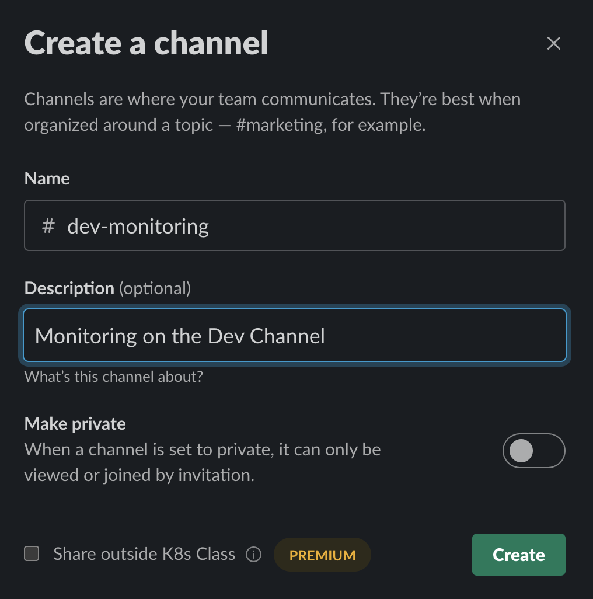
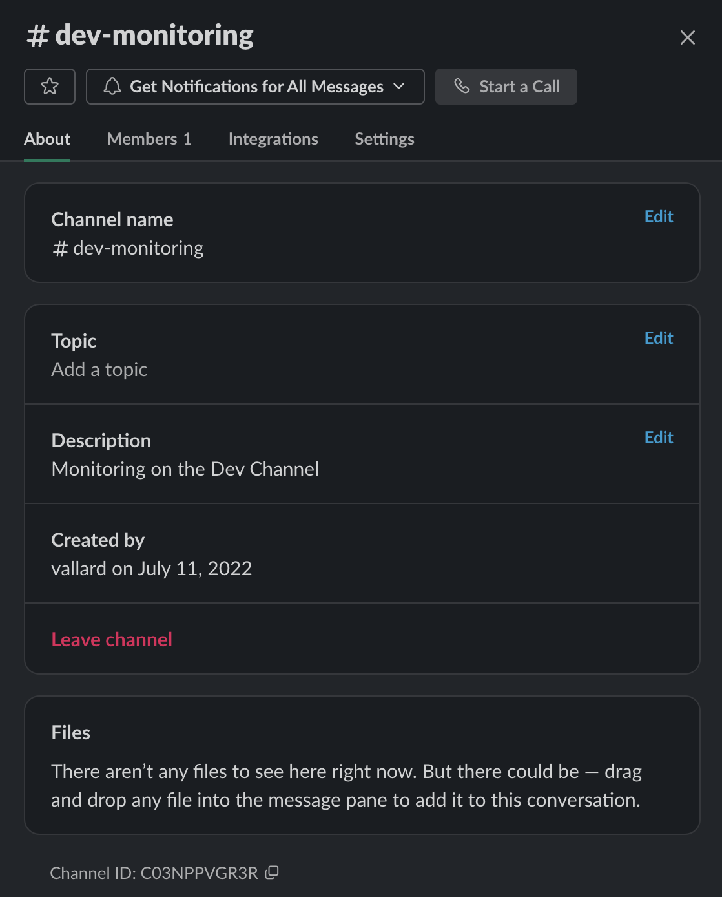
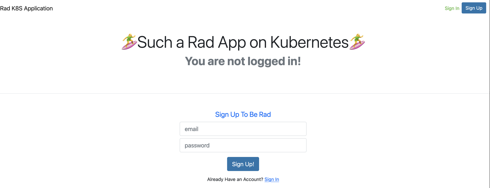

# Basic Application

We need to get our application ready so we can see about application alerts.  First, we'll create a slack channel and slack bot then we'll store the secrets in AWS secrets manager, then we'll access the secrets using the [External Secrets Operator](https://external-secrets.io/v0.7.2/).


## Create A Slack Application

We first need to create a Slack Application and get a token for posting to our Slack messages. 

I find this process extremely not-straightforward, but the idea is you must: 

1. Create an application
2. Create give the application permissions to post messages
3. Install the application in your workspace.

When you create the application you can go to the applications dashboard [https://api.slack.com/apps/](https://api.slack.com/apps/) and hopefully find the `OAuth & Permissions` section. 



From there add the bot permissions: 



You should add: 

* `chat:write`
* `chat:write:public` - this way you can write to any channels in the workspace. 

Create a  `Bot User OAuth Token` on this same page.  This is the token we will save in our environment as `SLACK_TOKEN`.  We also need to create a channel and then get the channel so we can post there.  

This is done by right clicking on a channel's info button and copying the channel id)



Clicking in the channel information button you can get the Channel ID down at the bottom. 



## Store Slack environment locally

For development I put these in my `~/.zshrc` or `~/.bash_profile` (depending on shell) so it looks like: 

```
export SLACK_TOKEN=xoxb-28...
export SLACK_CHANNEL=C03NPPVGR3R
```
Now I can develop this locally.

In the app directory, let's edit the [docker-compose.yaml](../app-api/docker-compose.yaml) file and add the following to the environment variables: 

```
		- SLACK_TOKEN=${SLACK_TOKEN}
		- SLACK_CHANNEL=${SLACK_CHANNEL}
``` 
This allows us to grab the slack environment variables. 

Notice iside the application there is a slack library called [slack.py](../app-api/app/lib/slack.py) where we can create a client and send messages to slack.  

We want to be alerted when a new user signs up successfully.  Let's alert on that by modifying the backend sign up.  This is done by opening the file: 

[app/routers/auth.py](../app-api/app/routers/auth.py).  We add the following lines after a user is created: 

```
sc = SlackClient()
sc.post_message(f"New Customer signed up: {user.email}")
```

To keep data private you may want to put the user id or some other value for this.  Let's try this out. 

```
cd app-api
make dev
```

This will run locally.  To get the front end locally, open another browser and run: 

```
yarn install
yarn start
```
## Secrets in Kubernetes

Now that we can run locally need to store these passwords for our application. We will use External Secrets with Secrets Manager.  

We can store all our secrets in one place; database permissions, slack APIs, etc.  The cost to store this in AWS Secrets manager is $0.40/month.  

### Create Secret in Secrets manager

We will add our Slack tokens to a file called `secrets.json`. In this file there are also other secrets we'll use for our application for passwords and connecting to our database.  Edit this file to include your slack token and change your database password if needed.  If using something else for a database later on (like RDS) you can put these credentials as well.  

### Upload to AWS

We can upload by running the command: 

```
aws secretsmanager create-secret --name super-secrets --secret-string file://secrets.json
```

Open up secrets manager on the console and verify it looks good (e.g: There are values for each of the secrets defined). 

### Install External Secrets

```
helm repo add external-secrets https://charts.external-secrets.io
helm repo update
helm install external-secrets \
   external-secrets/external-secrets \
    -n kube-system \
    --create-namespace \
    --set installCRDs=true
```

Now we'll need to create a secret that we'll use to store the following information about our application: 

* Database connection details (host, password, etc)
* Slack Secrets


### Clean up (For after class)

When you are done secrets manager makes you wait a minimum of 7 days to delete the secret if you do it from the console. I'm guessing they've had a fare amount of angry customers who deleted their secrets and needed them 2 min after they deleted. That's good, but we prefer to instead do this from the cli so it happens instantly:

```
aws secretsmanager delete-secret --secret-id arn:aws:secretsmanager:us-west-2:188966951897:secret:super_slack_secrets-31HOxE --force-delete-without-recovery
```

$0.40 isn't much, but I don't think Amazon needs more money from me :-) 

## Installing to Kubernetes

There is a yaml file we can use, be sure to edit to use your own domain.  Also ensure your secrets are set inside AWS secrets manager.  You can run: 

```
kubectl apply -f app-api/app-api.yaml
```

The front end, similarly can be applied with: 

```
kubectl apply -f app-fe/app-fe.yaml
```

You can get the urls with 

```
kubectl get ing -A
```

When we login we can now see alerts in Slack. 



## Module 2 Summary

In this module we learned how to make a slack client, robot, and receive alerts.  The important part that relates to Kubernetes is how you can store the secrets for accessing in Kubernetes without compromising by storing secrets in code. 


