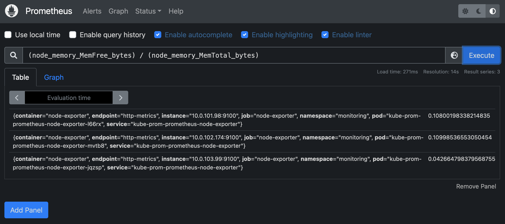
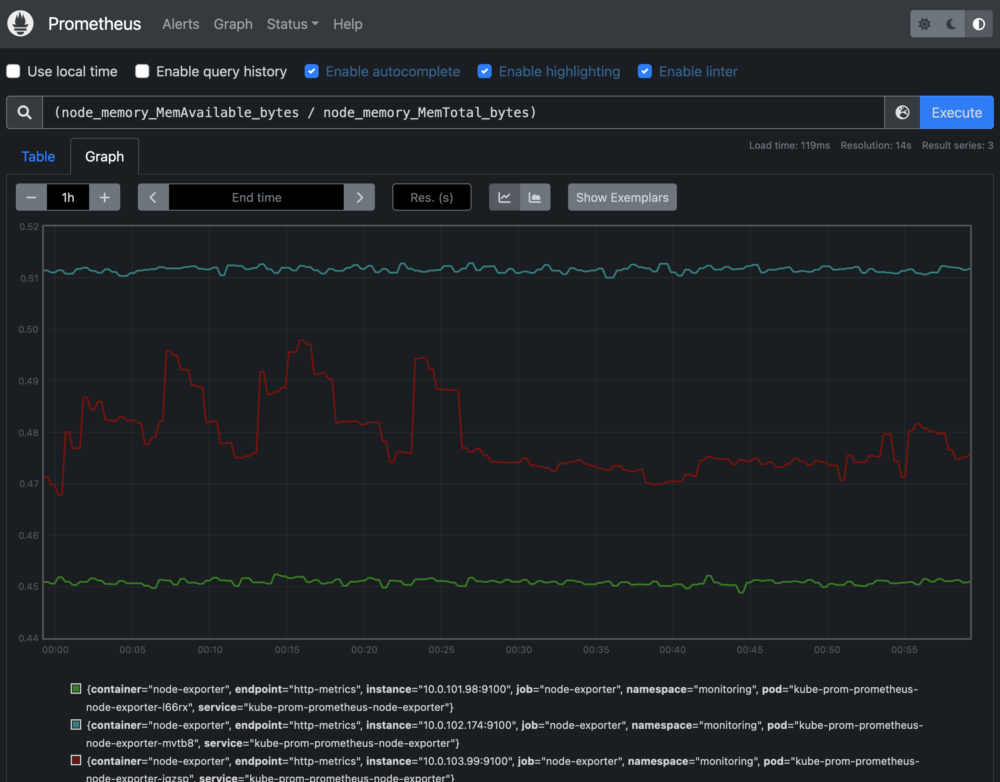

# Prometheus

From the [prometheus website](https://prometheus.io/docs/introduction/overview/): 

"Prometheus is an open-source systems monitoring and alerting toolkit originally built at SoundCloud. Since its inception in 2012, many companies and organizations have adopted Prometheus, and the project has a very active developer and user community.

Prometheus collects and stores its metrics as time series data, i.e. metrics information is stored with the timestamp at which it was recorded, alongside optional key-value pairs called labels."

We use prometheus as a key way to monitor our cluster.  We can then visualize a lot inside of Grafana (which we'll get to later). 


## Installation

There is a helm chart called the [Kubernetes Prometheus Community Stack](https://github.com/prometheus-community/helm-charts/tree/main/charts/kube-prometheus-stack) that includes: 

* Prometheus (with Kubernetes operators)
* Grafana dashboards
* Alert Manager
* Node Exporters

These make it so we can install everything at one time and customize it as we like for Kubernetes. To prepare for installation we run: 


```
helm repo add prometheus-community https://prometheus-community.github.io/helm-charts
helm repo update
```

We can see what manifests are available with: 

```
helm search repo  prometheus-community
```

While there are component based repos that can be installed we will use `prometheus-community/kube-prometheus-stack`.  

To install vanilla we would run something like: 

```
helm install -n monitoring kube-prom prometheus-community/kube-prometheus-stack --version 44.3.0
```

But we would like to customize this first. 

## Customization

### Namespace

First, we'd like to put everything in a `monitoring` namespace so we can keep it all in one go. So we'll create the namespace in a yaml file. 


### Basic Authentication

We'd like to protect our data with some authentication even though it may not be the most secure.  To do that we can generate an `.htpasswd` file.  Let's do that online by entering a user and a password.  

One such site is [https://wtools.io/generate-htpasswd-online](https://wtools.io/generate-htpasswd-online).  Here we enter:

```
user: castlerock
password: secret
```
This generates: 

```
castlerock:$apr1$myhgrz8n$uFrwBOuaahCLgY5jL17bd.
```

We now base64 encode that with: 

```
echo 'castlerock:$apr1$myhgrz8n$uFrwBOuaahCLgY5jL17bd.' | base64
``` 

This gives us the output: 

```
Y2FzdGxlcm9jazokYXByMSRteWhncno4biR1RnJ3Qk91YWFoQ0xnWTVqTDE3YmQuCg==
```

We take that output and add it to the secret file that is in our `supporting.yaml` file. 

It looks like this: 

```yaml
# secret for basic auth
apiVersion: v1
kind: Secret
type: Opaque
metadata:
  name: htpasswd
  namespace: monitoring
data:
  auth: Y2FzdGxlcm9jazokYXByMSRteWhncno4biR1RnJ3Qk91YWFoQ0xnWTVqTDE3YmQuCg==
```

Now we can create all that with: 

```
cd m03
kubectl apply -f supporting.yaml
```

### Helm Customizations

There are three components of the stack that are worth customizing for us: 

* AlertManager
* Prometheus
* Grafana

Since this is an all-in-one repository we can configure each of these in the same `yaml` file. 

#### AlertManager

```yaml
alertmanager:
  enabled: true
  baseURL: "https://prometheus.k8s.castlerock.ai"
```

#### Prometheus

```yaml
prometheus:
  prometheusSpec:
    retention: 14d
    scrapeInterval: 30s
    evaluationInterval: 30s
    storageSpec:
      volumeClaimTemplate:
        spec:
          storageClassName: gp2
          accessModes: ["ReadWriteOnce"]
          resources:
            requests:
              storage: 5Gi # you probably want more for production

```

A few notes on this setup: 

1. We want persistence for the metrics in the case of updates and reboots.  Most of this spec is to use the default AWS EC2 storage class `gp2`.  
2. We only keep the metrics for 14 days.  This can be changed. 
3. We scrape and evaluate the metrics from the sources every 30 seconds.

We have seen good success in isolating our prometheus pod to its own nodegroup. That way other Pods are not scheduled.  This is a recommended practice especially if you have a lot of metrics. 

To do that we would add a toleration to the spec: 

```yaml
	tolerations:
      - key: "appGroup"
        operator: "Equal"
        value: "monitoring"
        effect: "NoSchedule"
    nodeSelector:
      appGroup: monitoring
```

Further customizations are available at:
[The Chart Repo](https://github.com/prometheus-community/helm-charts/blob/main/charts/kube-prometheus-stack/values.yaml)

Let's install this configuration: 

```
helm upgrade --install -n monitoring \
	kube-prom -f prometheus.yaml \
	prometheus-community/kube-prometheus-stack \
	--version 44.3.0
```

We should now be able to visit the site to see it!

```
kubectl get ing -A
```
This should show you what URLs you have to visit. In my case it's 

[https://prometheus.k8s.castlerock.ai](https://prometheus.k8s.castlerock.ai)


Prometheus is polling architecture and goes to each target and scraps it. 

Thanos is for cross Data Center metrics. We won't talk about that in this class but it is installed by default. 

```
Series == Metrics == Time Series
```

Two types: 

* Counter - always going up. 
* Gauge - Just a number

Use Prometheus to find the data.

Every metric has a label and a value. 

## Explore the PromQL Dashboard

Look at memory available: 

```
(node_memory_MemAvailable_bytes / node_memory_MemTotal_bytes)
```



Now we could also make an alert based off free memory usage when it gets down to 85% used: 

```
(node_memory_MemFree_bytes) / (node_memory_MemTotal_bytes) < bool 0.15
```

This shows us when our memory usage is high. E.g: we are running out of memory.

We can also see graphs of these queries by checking out the graph button



This graph shows that our nodes are around 50% capacity in memory. 

## Kube-Proxy (Older versions, fixed in Kuberenetes >=1.24)

As part of the set up the `kube-proxy` in EKS doesn't work.  We have to patch this: 

```
kubectl edit cm kube-proxy-config -n kube-system
## Change from
    metricsBindAddress: 127.0.0.1:10249 ### <--- Too secure
## Change to
    metricsBindAddress: 0.0.0.0:10249
```

Then restart the `kube-proxies`: 

```
kubectl rollout restart ds kube-proxy -n kube-system
```

(credit: [alternaivan](https://github.com/prometheus-community/helm-charts/issues/977#issuecomment-888161858))
