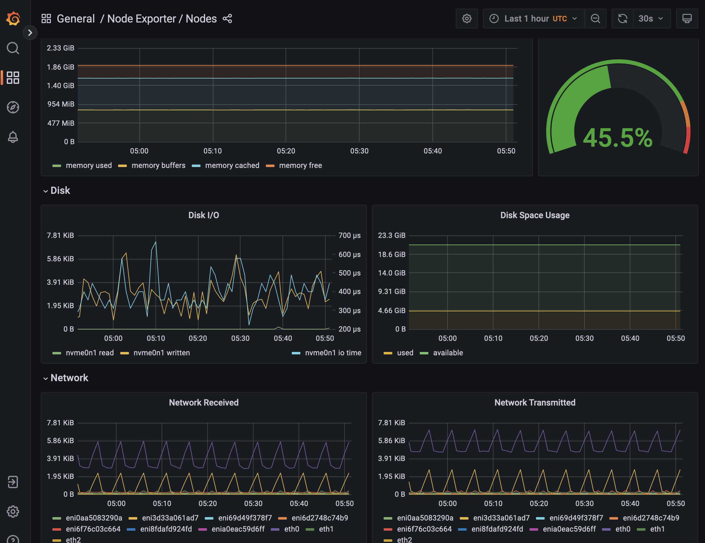
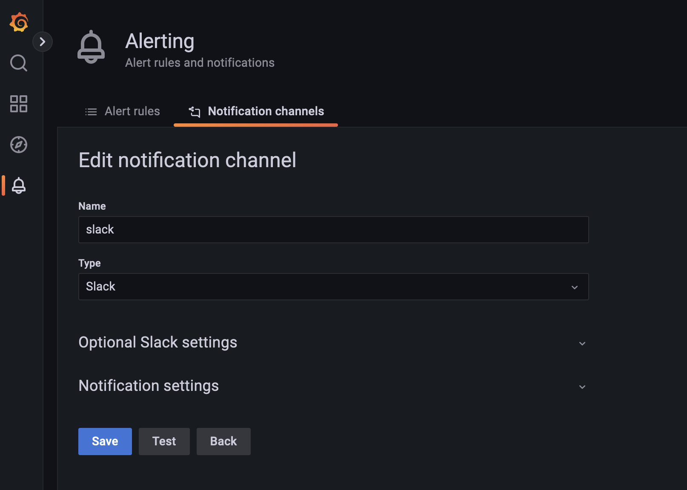
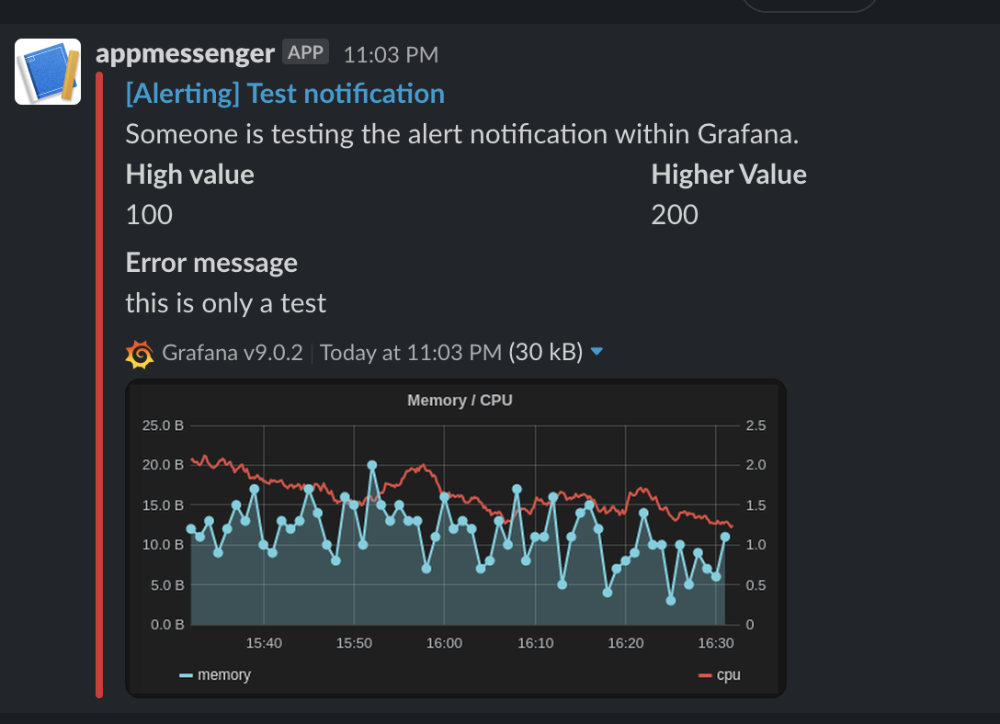
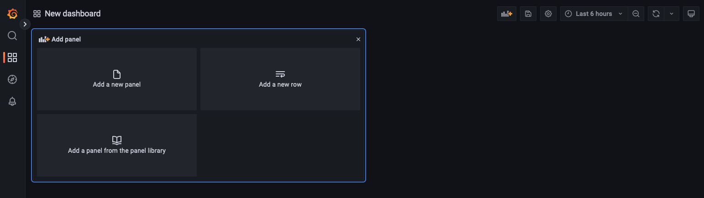
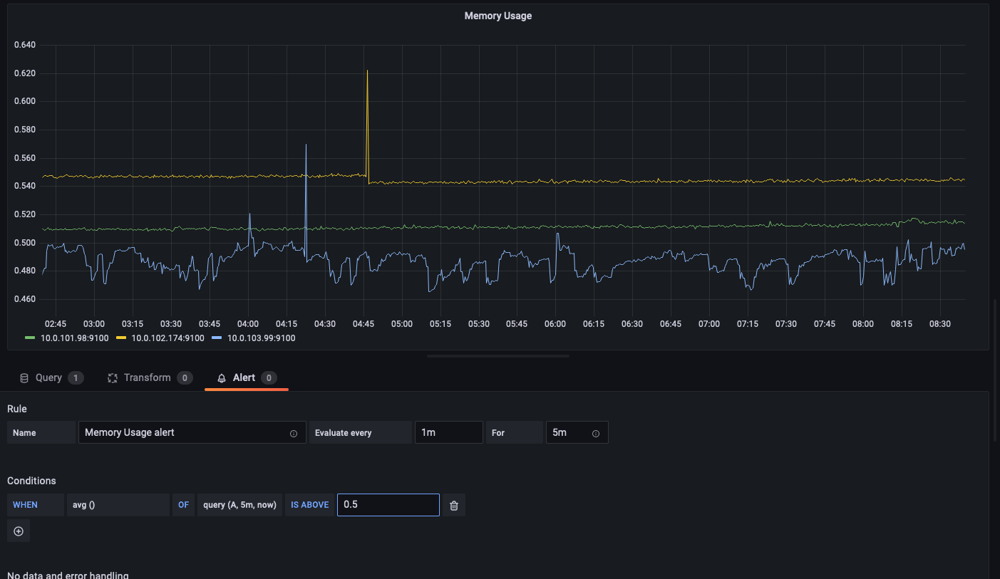
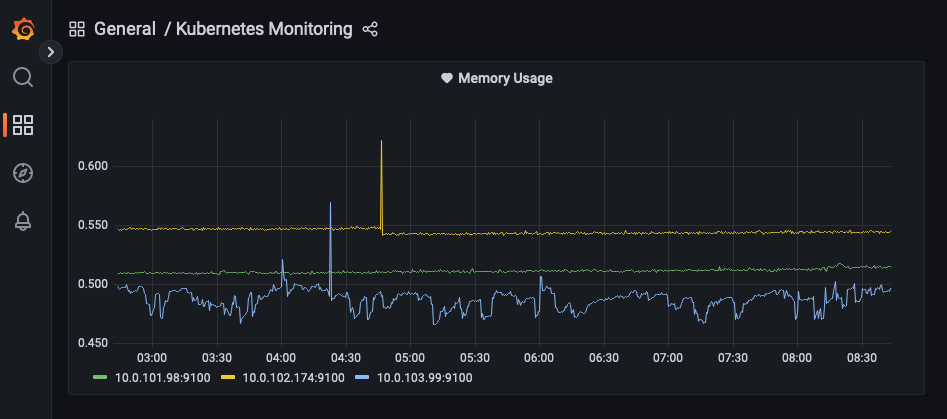
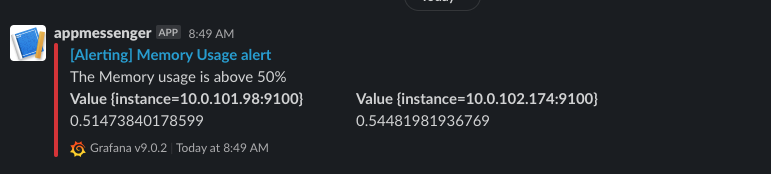

# Grafana

While Prometheus has some great metrics and even shows some graphs, Grafana is a far more powerful place to feed all these graphs and visualize them.  In addition to that, there is a community that has already made many graphs you might want to use for your cluster.  These graphs can help you understand everything in your environment.  

Grafana is already part of the Prometheus stack we installed in the previous section.  But let's configure it here so we can see some cool things. 

```
helm upgrade --install -n monitoring \
	kube-prom -f prom-stack-with-grafana.yaml \
	prometheus-community/kube-prometheus-stack \
	--version 37.2.0
```

## Customizations

We add some customizations by looking at the values in the [helm chart](https://github.com/grafana/helm-charts/blob/main/charts/grafana/values.yaml). 

```yaml
defaultDashboardsEnabled: true
  adminPassword: password
  grafana.ini:
    auth:
      disable_login_form: true
    auth.anonymous:
      enabled: true
      org_role: Admin
    unified_alerting:
      enabled: false
    alerting:
      enabled: true
      execute_alerts: true
    server:
      domain: grafana.k8s.castlerock.ai
      root_url: https://%(domain)s/
    dashboards:
      default_home_dashboard_path: /tmp/dashboards/k8s-dashboard.json
  # grab dashboards from sidecars
  sidecar:
    enabled: true
    dashboards:
      label: grafana_dashboard
      labelValue: 1
      searchNamespace: monitoring
      provider:
        allowUiUpdates: true
    datasources:
      label: grafana_datasource
      labelValue: 1
      searchNamespace: monitoring
    notifiers:
      enabled: true
      label: grafana_notifier
      labelValue: 1
      searchNamespace: monitoring
```

## Logging In

We encoded it with a password `castlerock / secret` like the previous dashboards.  We can explore the given dashboards that accompany the default installation under browse.  This shows us Kubernetes resources in an easy to understtand graph. 



These are great because they are installed by default.  


## Adding Slack

Edit the `slack-notifier.yaml` file and add in a webhook URL so that alerts can be triggered. 

```
kubectl apply -f slack-notifier.yaml
```

Now restart grafana to add the notifier: 

```
kubectl rollout restart -n monitoring deployment kube-prom-grafana
```
Now we see the slack notification is present.  We can test it using the test button. 



This gives us an alert in slack



Now we can set an alarm if something goes bad to notify us in slack. 

Similarly, we can put one in for PagerDuty to alert us when things don't go as expected. 

## Add a New Dashboard

Let's add a basic dashboard to monitor the memory usage of a node.  Then we can add an alert if the memory gets too high. 

On the 4 squares click create new dashboard.  



Let's click on `code` and in the metrics browser let's put in: 

```
max by (instance) (
node_memory_MemTotal_bytes{job="node-exporter"} - 
node_memory_MemFree_bytes{job="node-exporter"} - 
node_memory_Buffers_bytes{job="node-exporter"} - 
node_memory_Cached_bytes{job="node-exporter"}
)

/
 
max(node_memory_MemTotal_bytes{job="node-exporter"}) by (instance)
```

Here we can see that the memory usage of our nodes is around 50%.  Let's see what happens if we set an alarm on it. 



Next add slack as the notification and add that to the bottom.  After about 5 minutes we should see an alert in slack telling us that the memory is too high.  We probably can put that to 85% 



When we get the alert 5m later it looks like the below and sends a message to slack



## Persist New Dashboard

Perhaps now is a good time to persist this dashboard into an infrastructure as code solution.  First let's set the memory threshold around 87% to alert us.  Then we can copy the json. 


We can copy the json from this file by clicking on the `JSON Model` to the left of the dashboard. This allows us to save this dashboard. 

We have placed this json file in a `ConfigMap`.  Generally in production we will create our own helm package and put the file in with it. 

```
cd custom
kubectl apply -f k8s-configMap.yaml
```

Now we can reload our dashboard with helm and the changes we put there to show our new dashboard as the default dashboard.  

Doing this allows us to have a custom first page dashboard. 

```
helm upgrade --install -n monitoring \
	kube-prom -f prom-stack-with-grafana-custom.yaml \
	prometheus-community/kube-prometheus-stack \
	--version 37.2.0
```

Now we have our default dashboard as our starter home page for Grafana, and we are getting alerts!


