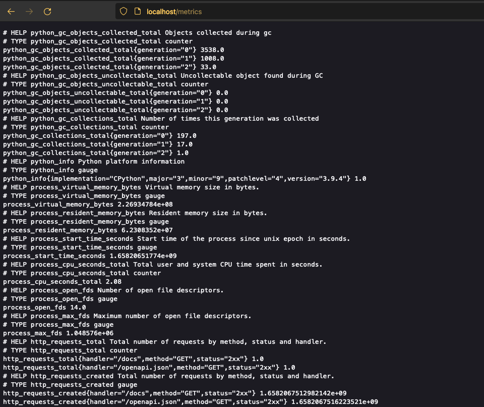
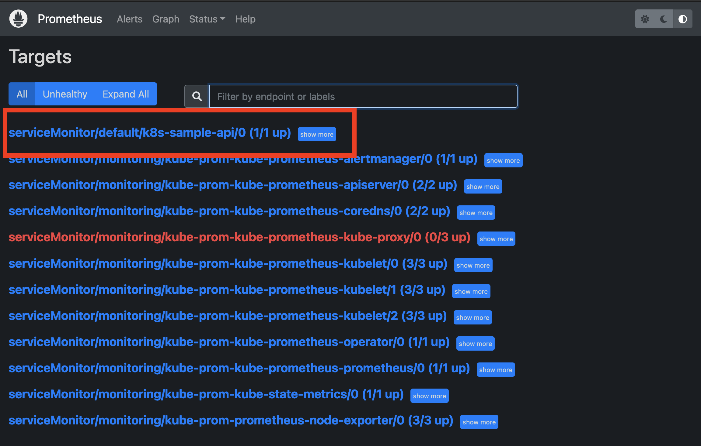
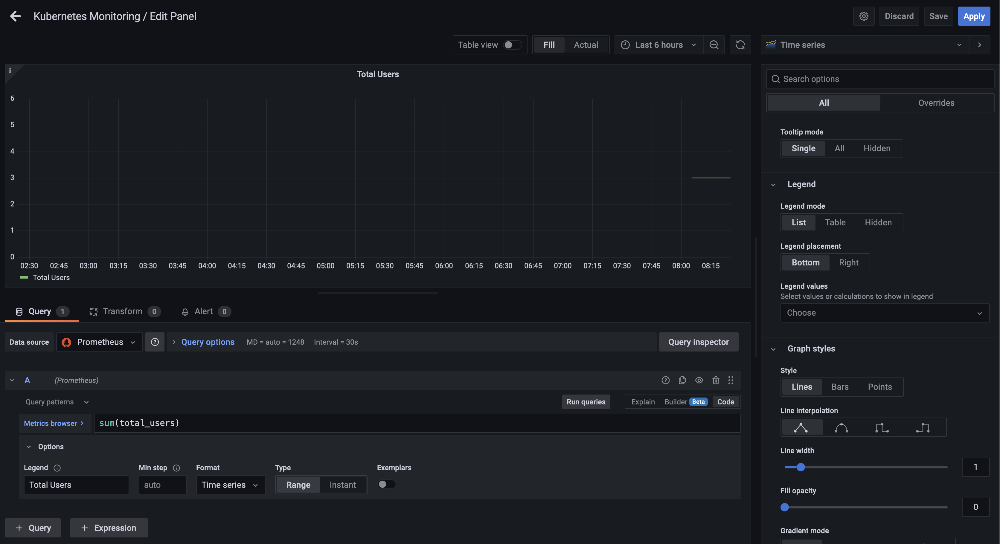
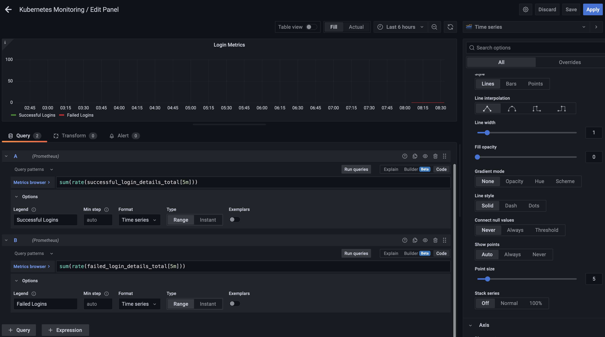
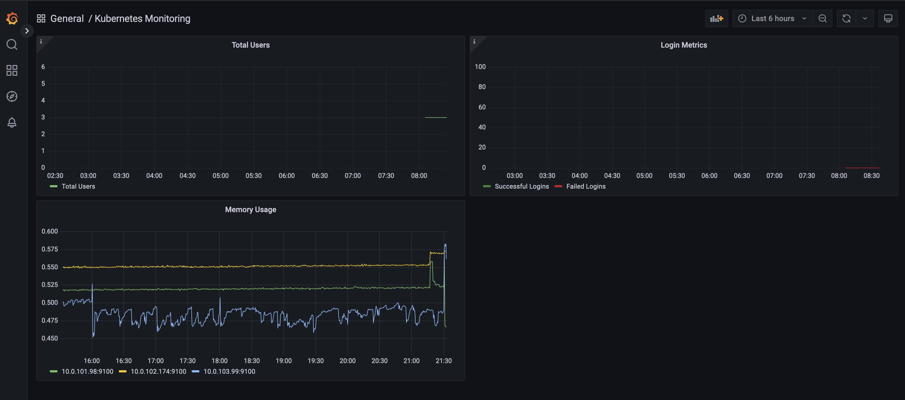
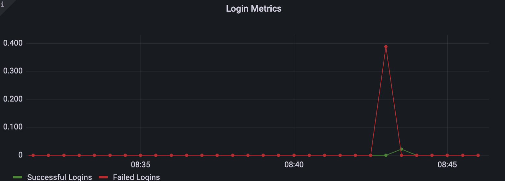
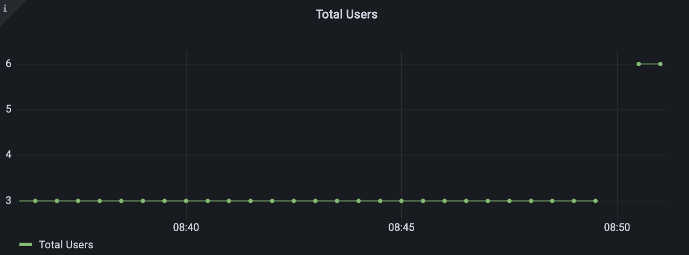

# Prometheus to Application


## FastAPI and Prometheus

It's worth checking to see what default prometheus libraries already come with whatever framework you are using.  In our case we are using FastAPI as our application framework.  There is a library called [Prometheus FastAPI Instrumentator](https://github.com/trallnag/prometheus-fastapi-instrumentator) that provides us some of this functionality out of the box. 

We can put this in our application in the `main.py`. 


```
from prometheus_fastapi_instrumentator import Instrumentator
``` 

Then we make a startup function for our application: 

```
@app.on_event("startup")
def init_instrumentator():
    """Setup prometheus instrumentation for the API"""
    Instrumentator().instrument(app).expose(app)
```

Restarting our development environment we see that this creates a `/metrics` endpoint for our application.  You can see this on the app: 



We don't typically like to expose metrics like this outside of Kubernetes to the outside world, but for this application we are ok for now. 

Ways to handle this:
 
* There may be instead a front end for backend, so keep this entire API not exposed.
* Others?

## Prometheus Client

There is also the [Official Python Prometheus Client](https://github.com/prometheus/client_python) that we can use to get even more customized with our metrics.

To use this we start defining our own metrics.  For this example we will monitor successful and failed login attempts on our application.  

This can be done by editing the `app/routers/auth.py` file where the login happens.  

We add the following towards the top of the file: 

```
from prometheus_client import Counter

SUCESSFUL_LOGIN_DETAILS = Counter(
    "successful_login_details", "Successful login details"
)
FAILED_LOGIN_DETAILS = Counter("failed_login_details", "Failed login details")
```

This defines the Counter we are going to instrument.  Next we can add this to the `login` function at the bottom: 

```
 if not user:
        # PROMETHEUS (part 5)
        FAILED_LOGIN_DETAILS.inc()
        # END PROMETHEUS (part 5)
        raise HTTPException(status_code=400, detail="Incorrect username or password")

    # PROMETHEUS (part 5)
    SUCESSFUL_LOGIN_DETAILS.inc()
    # END PROMETHEUS (part 5)
```
Here we are incrementing the counters.  

Another place we can can have a metric is the total number of users in our application.  For this we query the database periodically to see what our count is. 

In `main.py` we can do: 

```
from prometheus_client import Gauge
```

And then a new startup section: 

```
@app.on_event("startup")
@repeat_every(seconds=30, wait_first=True)
def periodic():
    count = engine.execute("select count(id) from user").scalar()
    Gauge("total_users", "Total Users").set(int(count))
```
We can look at our metics page and search for these metrics. Let's push this up to our kubernetes image: 


```
make push 
kubectl rollout restart deployment k8s-sample-api
```

Make sure it restarted by visiting: [https://api.k8s.castlerock.ai/metrics](https://api.k8s.castlerock.ai/metrics).


## Scraping

Now that our metrics are up, we need to tell Prometheus to scrape the metrics.  To do this we create a `ServiceMonitor`.  This is a custom resource definition:


```
kubectl apply -f servicemonitor.yaml
```

Prometheus should pick up this change and you should now see the app in the prometheus targets dashboard.  




Now showing?  There is a [troubleshooting document](https://github.com/prometheus-operator/prometheus-operator/blob/main/Documentation/troubleshooting.md#troubleshooting-servicemonitor-changes)

## Grafana Integration

Now that we have new metrics from our application, we can add this to our dashboard in Grafana.  This gives us a cool overview of how many users we have as well as failed and successful login attempts!

### Adding the Total Users Dashboard

In Grafana: 

* Add a panel 
* In the metrics browser just use `total_users`.  Since this is just a gauge and a constant metric we can simply see this and see how many users we have. Since we would rather not have all the labels shown for this simple metric, we can just use the sum.  `sum(total_users)`. If we had multiple containers we may have to change this. 
* The legend can be changed as well to show something more clean and meaningful.



We'll see the total users gauge start to form. 

Click `Apply` to see this in our main dashboard. 

### Adding the Login Success/Failures

* Add a Panel
* Title: Login Success/Failure Rates
* This time we are using `Counters` and not a `Gauge` so we should use a rate.  (That way when the application restarts we can see it). 
* The first one is the successful logins: `sum(rate(successful_login_details_total[1m]))`
* Make it green and update the legend to say `Successful Logins`

* Add a new query with the failed logins metric: `sum(rate(failed_login_details_total[1m]))`
* Make it red and update the legend to show `Failed Logins`





Click `Apply` to make this show.  You can arrange the dashboards to get a pretty good overview chart.  What a great application dashboard we have now!



### Testing it out

Let's make sure this graph works by adding a few users and trying to login a few times. 



We could make our rates make more sense, but here we see there are some number of successful logins and some failures. 

Similarly for the users:  




### Adding persistence

To make this a general part of our stack, save the json file and then put it in the existing `configMap` file we already created.  This will be pretty long!  Again, we usually use helm templates to reference the file so we don't have to get the alignment working. 

There is an export button to view the JSON. Then you can copy it and use it

```
kubectl apply -f k8s-configMap.yaml
```

Now we can restart grafana: 

```
kubectl rollout restart -n monitoring deployment kube-prom-grafana
```

Now our dashboard persists!


 