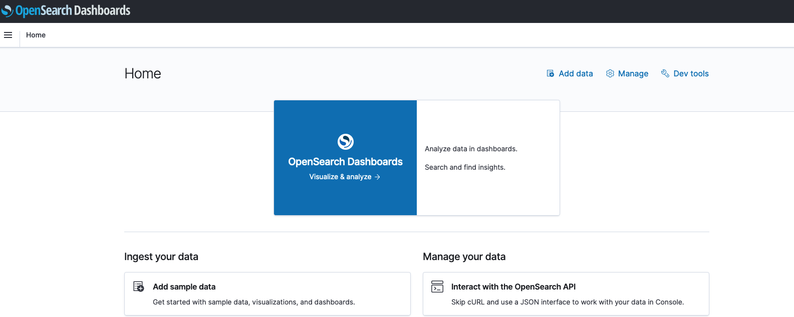
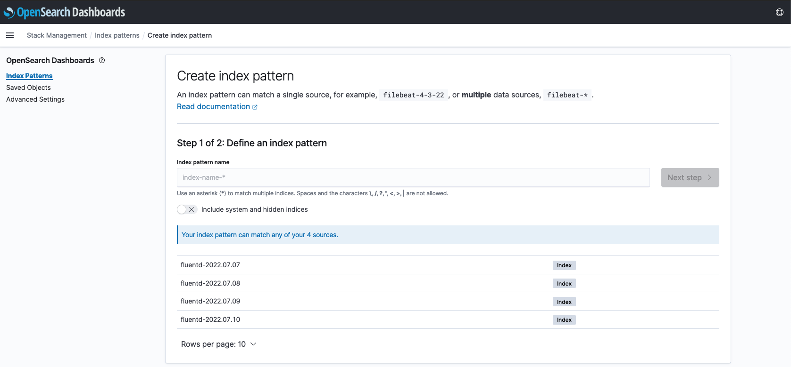
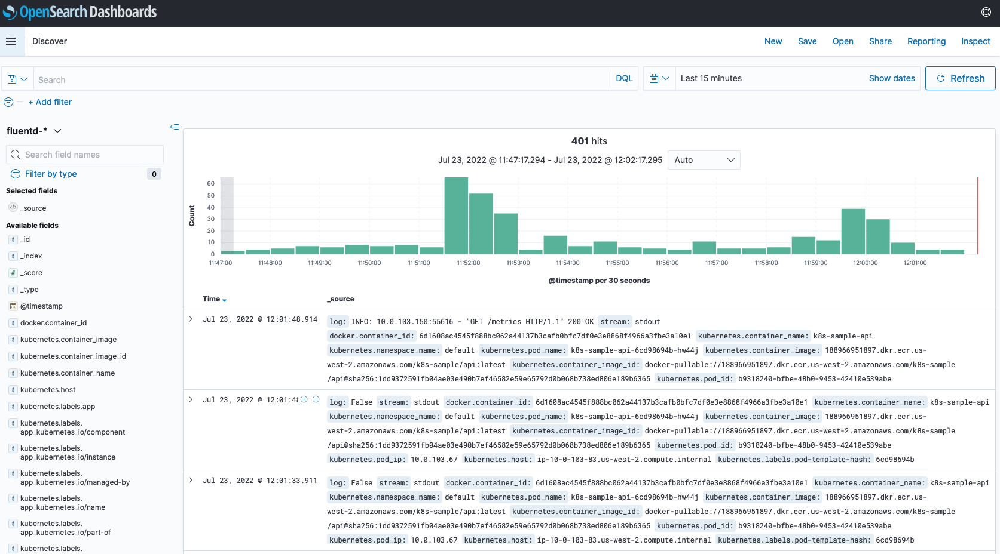

# The EFK Stack

Logging information from your applications to search, verify, and index on is a great idea and gives added visibility.  In a production environment developers are constantly looking at logs to analyze user behavior, what went wrong, and find ways to improve the system. 


## Components

* Fluentd - This is the workhorse that gathers the logs from the system and then forwards them on to a centralized place.  But it can do more than that, it can forward logs to multiple places, transform them in place, and do other fancy tricks. 
* ElasticSearch (OpenSearch) - ElasticSearch is open source and the company behind them (Elastic) seemed to have issues with Amazon.  So Amazon forked it, and now offers OpenSearch.  Good or bad, this is what we'll use. 
* Kibana - This is our dashboard for viewing the logs and keeping them sorted. OpenSearch calls this OpenSearch Dashboards. Pithy rebranding, but we'll just call it Kibana. 

## Installation and Configuration

### OpenSearch

The first step is to install an OpenSearch Cluster.  We'll keep it small to start out with but notice how big these things can get, so watch it.  The other thing to watch for is that the logs constantly fill up!  We have implemented a culler in the past that culls these logs and clears out everything. 

The OpenSearch was installed as a terragrunt module before the course started. 

But now we'd like to access OpenSearch.  As it is going in through our private subnet we have no access to it from the outside.  However, we can make a password protect ingress rule that can allow us access to the kibana service.  

To do this we create a service with an [ExternalName](https://kubernetes.io/docs/concepts/services-networking/service/#externalname) that maps to OpenSearch.  

Then we create an ingress rule and now we have access to the kibana dashboard.  

```
kubectl apply -f kibana-proxy.yaml
```

This lets us login with our standard username/password and now we can visit: 

[https://kibana.k8s.castlerock.ai/_dashboards](https://kibana.k8s.castlerock.ai/_dashboards) and see our OpenSearch cluster



There's not much to see in here right now because there isn't data being exported to it from fluent!


### Fluentd

```
helm repo add fluent https://fluent.github.io/helm-charts
helm repo update
```

We will be adding our own values yaml to install this so that it forwards to our Elasticsearch cluster. 

You can see all the values that can be configured with: 

```
helm show values fluent/fluentd
```

We modify to add the OpenSearch cluster in there to forward logs. 

```
kubectl create ns fluentd
helm upgrade --install -n fluentd fluentd -f values.yaml fluent/fluentd
```

Make sure all the pods are up!

```
kubectl get pods -n fluentd
NAME            READY   STATUS    RESTARTS   AGE
fluentd-b4zf4   1/1     Running   0          2m34s
fluentd-jkc2h   1/1     Running   0          117s
fluentd-psxql   1/1     Running   0          2m37s
fluentd-rvmlb   1/1     Running   0          2m10s
```

There is good documentation on the [fluentd opensearch plugin](https://github.com/fluent/fluent-plugin-opensearch) as to how to configure this for your cluster. 

## Viewing Logs

Now we can log back into Kibana and examine the logs that are created.  

### Create an index



You should see our fluent logs starting to flow in.  We'll make an index with `fluentd-` to capture all our fluentd logs. 

For timestamp we'll use `@timestamp` that we are forwarding. 

Once complete we have an index!

### View logs in `Discover`

I usually spend most of my time in the `Discover` section of Kibana, though there are cool dashbaords you could probably create.  Most of the time we are looking to figure out what is happening with our application.  

To start our FEK stack up, we just set up the basics and monitored everything.  (That is what the `**` does in the first part of the dashboard.).  However, what we can do is create some logging in our application that will log transactions in OpenSearch.  That's what we will do in the next section. 

