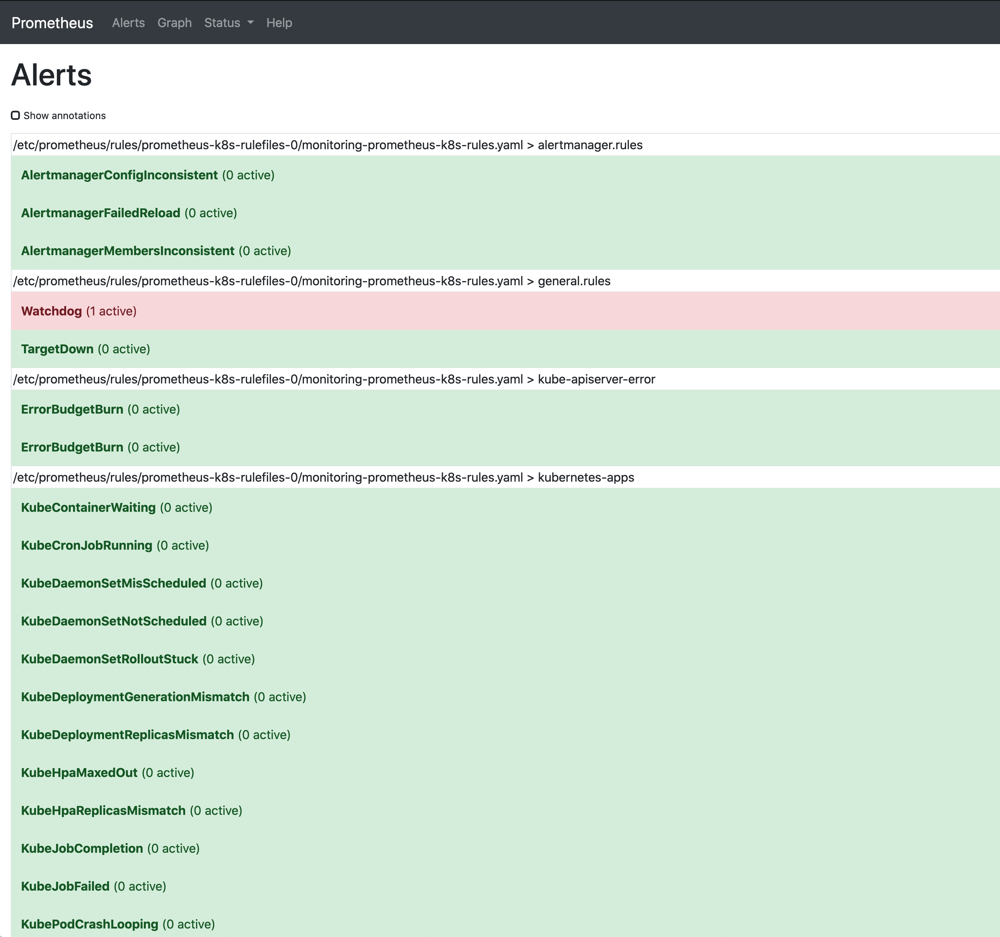

# Cluster Monitoring

We can use [Prometheus](https://prometheus.io) and [Grafana](https://grafana.com/) for monitoring our cluster. 

## Metrics Server

In [Segement 06](../segment06-admin/README.md) we installed the metrics server.  Be sure this is done.

Check it is with: 

```
kubectl get --raw /metrics
```


## Prometheus Operator

You can install the operator by cloning the [Prometheus Operator](https://github.com/prometheus-operator/kube-prometheus) repository with: 

```
git clone https://github.com/prometheus-operator/kube-prometheus
```

Find the appropriate release for your version of Kubernetes in the table.  For example, if you were using Kubernetes 1.17 (run `kubectl version` to see what you are running) you would see the [README](https://github.com/prometheus-operator/kube-prometheus/blob/master/README.md) shows I should be running `release-0.4`.  So to install we run: 

```
cd kube-prometheus
git branch -a
```
Here we see all the branch names.  To switch to the release branch run: 

```
git checkout remotes/origin/release-0.4
```

Now we can install the operator with: 

```
kubectl create -f manifests/setup
```

You should then be able to see custom resources, `servicemonitors` by running: 

```
kubectl get crd
```
And see there is a `servicemonitors.monitoring.coreos.com` custom resource definition. 

Once that is defined you can install the rest of the monitoring components: 

```
kubectl create -f manifiests/
```

You'll be able to see all the resources defined in the `monitoring` namespace with: 

```
kubectl get pods -n monitoring
```

Output looks as follows: 

```
NAME                                   READY   STATUS    RESTARTS   AGE
alertmanager-main-0                    2/2     Running   0          3m15s
alertmanager-main-1                    2/2     Running   0          3m15s
alertmanager-main-2                    2/2     Running   0          3m15s
grafana-58dc7468d7-vvcnc               1/1     Running   0          3m12s
kube-state-metrics-765c7c7f95-kxddc    3/3     Running   0          3m12s
node-exporter-cnhm6                    2/2     Running   0          2m15s
node-exporter-vnh9r                    2/2     Running   0          3m13s
prometheus-adapter-5cd5798d96-j8xnn    1/1     Running   0          3m13s
prometheus-k8s-0                       3/3     Running   1          3m13s
prometheus-k8s-1                       3/3     Running   1          3m13s
prometheus-operator-5f75d76f9f-n9krn   1/1     Running   0          7m2s
```

### Ingress Rules

We now have three dashboards exposed to us, but they are, of course secured behind our firewall.  We can access them with: 

```
kubectl --namespace monitoring port-forward svc/prometheus-k8s 9090
kubectl --namespace monitoring port-forward svc/grafana 3000
kubectl --namespace monitoring port-forward svc/alertmanager-main 9093
```

Connecting then to `localhost:9090` would allow us to connect to Prometheus: 



We can expose these with an ingress rule as well.  You probably wouldn't want to expose your cluster like this to the outside world, but we will do this to show how to access them with our ingress controller that we created.  You should edit the `monitoring-ingress-rules.yaml` file and use your own domain name.  Once done you can run: 

```
kubectl apply -f monitoring-ingress-rules.yaml
```

Now we can access all of these at the folowing domains: 

* [grafana.k8s.castlerock.ai](https://grafana.k8s.castlerock.ai)
* [alertmanager.k8s.castlerock.ai](https://alertmanager.k8s.castlerock.ai)
* [prometheus.k8s.castlerock.ai](https://prometheus.k8s.castlerock.ai)


 